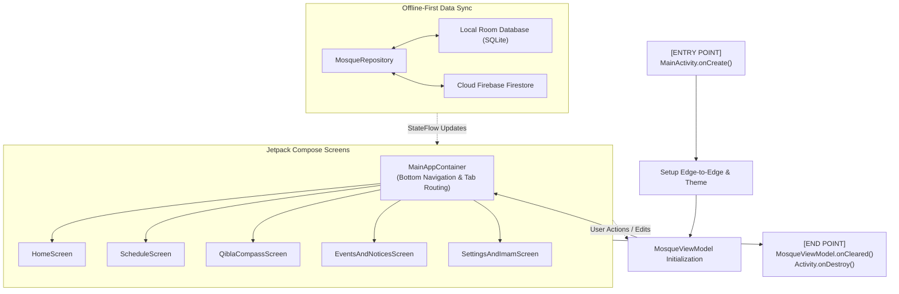

# 🕌 DUET Mosque Connect

> A modern, offline-first Android application designed for the **Dhaka University of Engineering & Technology (DUET) Central Mosque** community. Built with 100% Kotlin and Jetpack Compose (Material 3).

---

## 📖 Overview

**DUET Mosque Connect** bridges the DUET campus community with the central mosque by delivering real-time prayer timetables, live Jama'at countdowns, instant emergency announcements (Janaza alerts), Ramadan schedules, and a sensor-fused Qibla compass.

The app uses an **Offline-First Architecture**: all prayer times and announcements are cached locally in SQLite via Room, so the app remains 100% functional even when offline, while automatically syncing changes in real-time with Google Cloud Firestore.

---

## ✨ Key Features

| Feature | Description |
| :--- | :--- |
| ⏳ **Live Prayer Countdown** | Real-time ticker calculating hours, minutes, and seconds until the next Azan and Jama'at. |
| 📅 **Daily & Jummah Timetable** | Full schedule for Fajr, Dhuhr, Asr, Maghrib, Isha, and Friday Jummah prayers. |
| 🌙 **Ramadan & Solar Limits** | Accurate Sehri, Iftar, Ishraq, Chasht, Zawal, and Tahajjud timings. |
| 🧭 **Interactive Qibla Compass** | High-precision sensor fusion (magnetometer + accelerometer) with Kaaba heading, degree indicators, level detector, and haptic feedback. |
| 📢 **Notices & Campus Events** | Real-time news board with priority tagging, search, and one-tap social sharing. |
| 🕊️ **Janaza (Funeral) Alerts** | Dedicated urgent announcement cards with time, venue, and deceased details. |
| 🕌 **Eid Jamat Schedule** | Multi-jamat schedule listings for Eid-ul-Fitr and Eid-ul-Adha. |
| 🔐 **Imam / Admin Portal** | PIN-protected dashboard with brute-force lockout security, edit modals, and direct Firebase sync. |
| 📲 **Push Notifications** | Background push messaging via Firebase Cloud Messaging (FCM). |
| 🌓 **Adaptive Material 3 Theme** | Elegant Emerald Green (`#03A052`) and Notice Red (`#EB332C`) palette with seamless Dark/Light mode support. |

---

## 🏗️ Architecture & Technology Stack

The project follows modern Android architecture best practices using the **MVVM (Model-View-ViewModel)** pattern and the **Repository Pattern (Single Source of Truth)**.

```
┌────────────────────────────────────────────────────────┐
│                   UI Layer (Compose)                   │
│  HomeScreen • ScheduleScreen • QiblaCompass • Notices  │
└───────────────────────────▲────────────────────────────┘
                            │ (Collects StateFlow)
┌───────────────────────────┴────────────────────────────┐
│              ViewModel Layer (State Holder)            │
│                      MosqueViewModel                   │
└───────────────────────────▲────────────────────────────┘
                            │ (Flow streams & Coroutines)
┌───────────────────────────┴────────────────────────────┐
│                    Repository Layer                    │
│                    MosqueRepository                    │
└─────────────▲────────────────────────────▲─────────────┘
              │ (Local Cache)              │ (Realtime Sync)
┌─────────────┴─────────────┐ ┌────────────┴─────────────┐
│    Room SQLite Database   │ │     Firebase Firestore   │
│   (AppDatabase & DAOs)    │ │    (Cloud Realtime DB)   │
└───────────────────────────┘ └──────────────────────────┘
```

- **Language**: Kotlin 2.3+
- **UI Framework**: Jetpack Compose (Material 3)
- **Local Storage**: Room SQLite + KSP (Kotlin Symbol Processing)
- **Cloud Backend**: Google Firebase Firestore
- **Push Messaging**: Firebase Cloud Messaging (FCM)
- **Asynchronous Execution**: Kotlin Coroutines & Reactive `Flow` / `StateFlow`
- **Sensors & Location**: Google Play Services `FusedLocationProviderClient` & Android `SensorManager`

---

## 📁 Project Directory Structure

```
app/src/main/java/com/duet/mosque/connect/
│
├── MainActivity.kt                  # [ENTRY POINT] Activity lifecycle, permissions & Compose root
│
├── data/
│   ├── database/
│   │   ├── AppDatabase.kt           # Room SQLite database singleton & migrations
│   │   └── Daos.kt                  # Data Access Objects (SQL queries returning Kotlin Flow)
│   ├── model/
│   │   └── Models.kt                # Data entities (PrayerSchedule, News, Event, Janaza, Eid)
│   └── repository/
│       └── MosqueRepository.kt      # Offline-first repository syncing Room with Firestore
│
├── services/
│   └── MosqueMessagingService.kt    # Firebase Cloud Messaging background notification receiver
│
├── ui/
│   ├── components/
│   │   └── CommonComponents.kt      # Reusable UI widgets (KaabaIcon, TimePicker, Toggles)
│   ├── dialogs/
│   │   └── AdminDialogs.kt          # Modal CRUD forms for Imam/Admin updates
│   ├── screens/
│   │   ├── MainAppContainer.kt      # Root scaffold, bottom navigation bar & tab router
│   │   ├── HomeScreen.kt            # Hero countdown, 5-prayer cards & Ramadan card
│   │   ├── ScheduleScreen.kt        # Daily timetable (Fajr, Dhuhr, Asr, Maghrib, Isha, Jummah)
│   │   ├── QiblaCompassScreen.kt    # Canvas-drawn Qibla compass & sensor listeners
│   │   ├── EventsAndNoticesScreen.kt# Tabs for News/Notices, Events, Janaza, and Eid Jamats
│   │   └── SettingsAndImamScreen.kt # Settings, Imam PIN authentication & admin logs
│   ├── theme/
│   │   ├── Color.kt                 # Brand color tokens (Emerald Green, Notice Red, Gold)
│   │   ├── Theme.kt                 # Material 3 dark/light theme wrapper
│   │   └── Type.kt                  # Material 3 typography definitions
│   └── viewmodel/
│       └── MosqueViewModel.kt       # State holder, 1-sec countdown ticker & lifecycle teardown
│
└── utils/
    ├── CompassSensorManager.kt      # Hardware sensor listener, low-pass filter & Qibla math
    ├── LocationHelper.kt            # GPS coordinates & geocoding helper
    └── NotificationHelper.kt        # Android 8+ NotificationChannel & notification dispatcher
```

---

## 🔄 Application Execution Flow



1. **App Launch (Entry Point)**:
   - Android launches `MainActivity.onCreate()`.
   - Checks runtime notification permissions (`POST_NOTIFICATIONS`) and loads `MyApplicationTheme`.
2. **Data Initialization**:
   - `MosqueViewModel` initializes and attaches listeners through `MosqueRepository`.
   - Reads existing data from Room SQLite immediately (zero loading lag).
   - Syncs real-time updates from Firebase Firestore in the background.
3. **Screen Rendering**:
   - `MainAppContainer` displays the bottom navigation bar and renders the active tab.
   - UI elements observe ViewModel `StateFlow` streams via `.collectAsState()`.
4. **App Exit (Teardown Lifecycle)**:
   - `MosqueViewModel.onCleared()` cancels active coroutines and detaches Firestore listeners.
   - `QiblaCompassScreen` unregisters hardware sensor listeners via `DisposableEffect`.

---

## 🛠️ Getting Started & Build Instructions

### Prerequisites
- **Android Studio**: Ladybug (2024.2+) or newer
- **JDK**: Version 17 or 21
- **Android SDK**: `compileSdk = 37`, `minSdk = 24`, `targetSdk = 37`
- **Google Services**: A valid `google-services.json` placed inside the `app/` folder

### Build & Run Commands

Using the Gradle wrapper from your terminal:

```bash
# Check Kotlin compilation
./gradlew compileDebugKotlin

# Assemble Debug APK
./gradlew assembleDebug

# Install on connected device/emulator
./gradlew installDebug
```

---

## 💡 Kotlin & Jetpack Compose Cheat Sheet for Beginners

| Concept | Explanation | Example in Project |
| :--- | :--- | :--- |
| `val` vs `var` | `val` is read-only (immutable); `var` can be reassigned. | `val title: String` (Safety first!) |
| `data class` | A class created to hold data. Automatically generates `equals()`, `toString()`, etc. | `data class PrayerSchedule(...)` in `Models.kt` |
| `sealed class` | A restricted class hierarchy where all possible types are known at compile time. | `sealed class TabScreen(...)` in `MainAppContainer.kt` |
| `suspend fun` | A function that can pause execution without blocking the main UI thread. | `suspend fun insert(...)` in `Daos.kt` |
| `Flow<T>` | An asynchronous data stream that continuously emits updated values. | `fun getAllNews(): Flow<List<News>>` |
| `StateFlow<T>` | A state-holding observable flow that always keeps the latest value for the UI. | `val prayerTimes: StateFlow<List<PrayerSchedule>>` |
| `@Composable` | A declarative function that describes a piece of UI in Jetpack Compose. | `@Composable fun HomeScreen(...)` |
| `remember` | Preserves state values across UI recompositions. | `var expanded by remember { mutableStateOf(false) }` |
| `LaunchedEffect` | Runs asynchronous side-effects safely inside a Composable lifecycle. | `LaunchedEffect(Unit) { loadData() }` |
| `DisposableEffect` | Runs cleanup logic when a Composable leaves the screen (e.g. unregistering sensors). | `DisposableEffect(Unit) { onDispose { sensorManager.unregister() } }` |

---

## 🤝 Contribution & License

- **Developed for**: DUET Central Mosque & Campus Community
- **License**: Open-source for educational and community use.
